A **vowel** is a particular kind of speech **sound** made by changing the shape of the upper vocal tract, or the area in the mouth above the tongue. In English it is important to know that there is a difference between a vowel sound and a [letter] in the [alphabet]. In English there are five vowel letters in the alphabet.

The sounds of English are written with letters in the English alphabet, as either vowels or **consonant**s. All English words are written with vowel letters in them.

These letters are vowels in English:
A, E, I, O, U, and sometimes Y.

It is said that Y is "sometimes" a vowel, because the letter Y represents both vowel and consonant sounds. In the words *cry*, *sky*, *fly*, *my* and *why*, letter Y represents the vowel sound /aɪ/. In words like *myth* and *synchronize*, Y represents the vowel sound /ɪ/. In words like *only*, *quickly*, and *folly*, Y represents the vowel sound /i/.

It can also be a consonant sound called a *glide* as in the beginning of these words: *yellow*, *yacht*, *yam*, *yesterday*. Y is a consonant about 2.5% of the time, and a vowel about 97.5% of the time.

The letter W can sometimes be the second part of a vowel sound as in words like such as *cow*, *bow*, or *how*. In these words the vowel has the sound of /aʊ/. The letter W can be used as a consonant sound at the beginning of in the words *when*, *where*, *wet*. In some languages, like Welsh, the letter W represents the vowel sound /ʊ/, like *cwm*.

In written English the six vowel letters are used to represent the 13-15 vowel **sounds** (depending on the variety) in English. This means there are many more vowel sounds than letters in the English alphabet, and the English spelling systems doesn't always help us figure out what the English sounds are. This can be confusing.
* The rest of the letters of the alphabet are **consonant**s:
:B, C, D, F, G, H, J, K, L, M, N, P, Q, R, S, T, V, W, X, Y (sometimes), and Z.

## Monophthongs and diphthongs ##
Simple vowels are called **monophthong**s. The letters, like /ɪ/, are the International Phonetic Alphabet( IPA) letters for each vowel **sound** in English. In the IPA, each symbol represents a different sound, so using the IPA is helpful in pronouncing words.

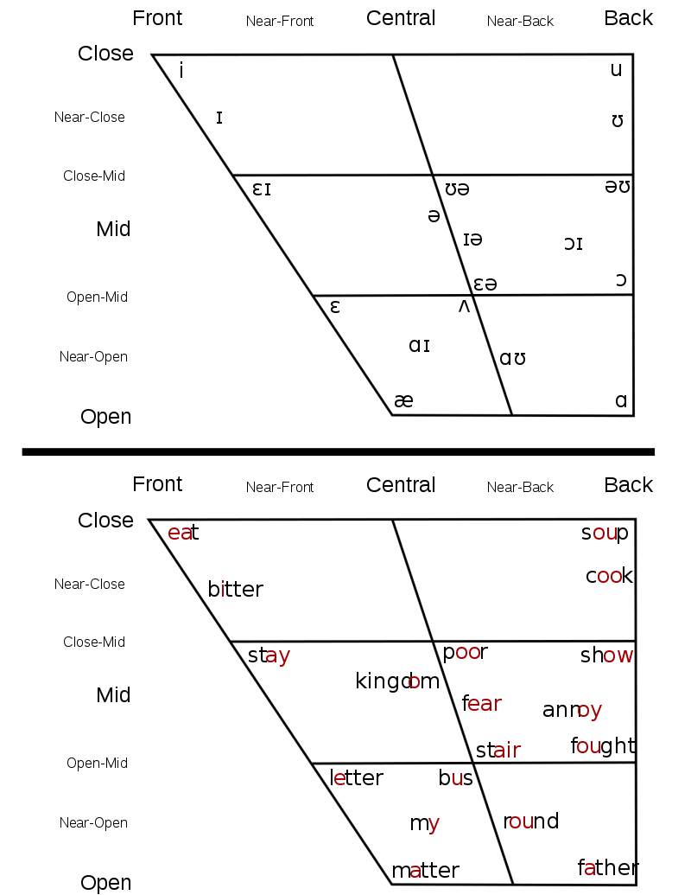

Common monophthongs in General American English include:
- /i/ as in pol*i*ce, f*ee*t, *ea*t, and sill*y*
- /ɪ/ as in *i*t, s*i*t, k*i*ck, m*y*th and b*i*tter
- /ɛ/ as in *e*nd, b*e*t, l*e*ss, and l*e*tter
- /æ/ as in *a*t, *a*pple, f*a*t, and m*a*tter
- /u/ as in c*oo*l, t*u*ne, s*ou*p, and kung f*u,* 
- /ʊ/ as in c*oo*k, sh*ou*ld, p*u*dding, and f*oo*t, r*ook*
- /ʌ/ as in b*u*s, bl*oo*d, c*o*me, and *u*p
- /ə/ as in kingd*o*m, ph*o*togr*a*phy, ph*i*los*o*phy, ketch*u*p, and h*u*ndred
- /ɚ/ as in butt*er*, coll*ar*, flav*or*, f*ir*m, and b*ur*st
- /ɔ/ as in *a*ll, f*ou*ght, h*o*t, and b*o*t
- /ɑ/ as in f*a*ther, w*a*lk, *a*rm, h*ea*rt, w*a*sp, l*a*ger, *e*nvelope and *aa*rdv*a*rk

**Diphthong**s are a combination of two different vowel sounds, one vowel sounds turns into another sound as you say them. If you pronounce the words below slowly, you can hear the two vowel sounds of the diphthongs.

Common diphthongs in English include:
* /eɪ/ as in *a*te, r*ei*gn, v*ai*n, fl*a*vor, sl*ay*, and conv*ey*
* /aɪ/ as in *eye*, *I*, p*ie*, cr*y*, c*y*pher, cl*i*mb, l*i*me, l*i*ght, k*ay*ak, Th*ai*, and h*ei*ght
* /oɪ/ as in b*oy*, m*oi*st, and Fr*eu*d
* /oʊ/ as in t*oe*, r*ow*, g*o*, b*oa*t, m*o*de, and chat*eau*
* /aʊ/ as in l*ou*d, h*ou*se, c*ow*, ab*ou*t, D*ao*ism, and Mac*au*

# Consonant

In articulatory phonetics, a **consonant** is a speech sound that is articulated with complete or partial closure of the vocal tract. Examples are IPA, pronounced with the lips; [t], pronounced with the front of the tongue; [k], pronounced with the back of the tongue; [h], pronounced in the throat; [f] and [s], pronounced by forcing air through a narrow channel (**fricative**s); and [m] and [n], which have air flowing through the nose (**nasal**s). Contrasting with consonants are **vowel**s.

In fact, the English alphabet has fewer consonant letters than English has consonant sounds, so **digraph**s like "ch", "sh", "th", and "zh" are used to extend the alphabet, and some letters and digraphs represent more than one consonant. For example, the sound spelled "th" in "this" is a different consonant from the "th" sound in "thin". (In the IPA, they are transcribed [ð] and [θ], respectively.)

In General American English, /r/ when not followed by a vowel is realized as an r-coloring of the preceding vowel or its coda: nurse [ˈnɚs], butter [ˈbʌtɚ].

# Stops
According to the organs involved in the closure of the oral cavity, stops are classed as follows:
- Bilabial stops: the airstream is held by using both lips. Bilabial stops are [ph], [p], [p˺], and [b].
- Alveolar stops: the airstream is held by pushing the tip of the tongue against the alveolar ridge. Alveolar stops are [th], [t], [t˺], and [d].
- Velar stops: the airstream is held by pushing the back of the tongue against the soft palate. Velar stops are [kh], [k], k˺, and [g].
- Glottal stops: the airstream is held by closing the vocal folds (remember that the space between the vocal folds is the glottis). Glottal stops are [ʔ] and [tʔ]. Sound [ʔ] is a pure glottal stop, not associated to any other sound, while [tʔ] is a co-articulation of [t] and [ʔ] (see Section 4.1.5subsubsection).

## Bilabial sounds [ph], [p], [p˺], and [b]
The closure of the oral cavity is carried out by the lips, which come together to stop the airstream. Then the airstream is held just behind the lips, and finally is released; see Figure 10. There are three voiceless allophones, [ph], [p], [p˺], and one voiced allophone, [b]. Spellings commonly associated with bilabials are p, pp for sound [p], as in pen[phen], happy[ˈhæpi], or lap[læp˺], and b, bb for sound [b], as in best[best] or robber[ˈrɑ:bər].

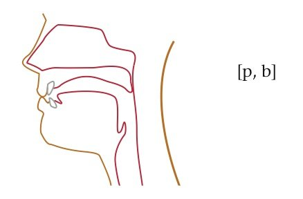

Fig. Manner of articulation of bilabial stops [p] and [b]

In this video Rachel describes all allophones of phoneme /p/.

Video. Rachel's English: How to Pronounce B and P consonants

## Alveolar sounds [th], [t], [t˺], and [d]
In alveolar sounds the closure is produced by the tongue blocking the airstream against the alveolar ridge; see the follow picture. In order to do so, the tongue widens to seal off the oral cavity. It is the blade of the tongue that makes contact with the alveolar ridge; the tip of the tongue is in rest position just behind the upper front teeth. As in the case of voiceless bilabial stops, there are an aspirated and de-aspirated allophones.

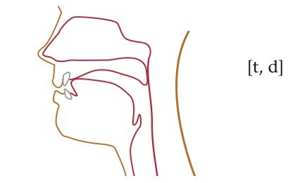

Fig. Manner of articulation of alveolar stops [t] and [d]

Common spellings of phoneme /t/ are:
- t and tt, as in ten[then], stop[stɑ:p], or wait[weɪt˺].
- The past simple of a regular verb ends in phoneme /t/ when the last sound of the verb is a voiceless sound different from /t/: trip[thrɪp]PICtripped[thrɪp˺t], ask[æsk]PICasked[æsk˺t], laugh[læf]PIClaughed[læfth], toss[tɑ:s]PICtossed[tɑ:sth], mash[mæʃ]PICmashed[mæʃth]. Past simple endings are often aspirated to clearly distinguish them from other tenses. Past simple endings are seldom unreleased.
Spelling th, although less frequent, can be found, as in Thailand[ˈthaɪlænd].

## Velar sounds [kh], [k], [k˺], and [g]
In velar sounds the closure is produced by the back of the tongue leaning against the soft palate, which blocks the airstream; see Figure 17. Similarly to bilabial and alveolar stops, aspirated, de-aspirated, and unreleased allophones ( [kh], [k], [k˺]) can be observed. When the stop is voiceless, sounds [kh], [k], and [k˺] are produced. If the stop is voiced, sound [g] results.

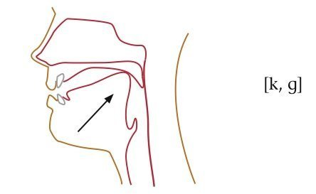

Fig. Manner of articulation of alveolar stops [k] and [g]

Common spellings of phoneme /k/ are:
- Letter c in word-initial, as in cat[khæt], and also within a word, as in fact[fæk˺t].
- Letter k in word-initial, as in keep[ki:p], and also within a word, as in like[laɪk].
- Combinations ck and ch, as in black[bæk] and school[sku:l].
- Combination qu, as in quiet[khwaɪət].
- Letter x, as in six[sɪks].

Sound [g] is normally spelled g or gg, as in girl[gɜ:rl] or egg[eg].

In the video below only [kh], [k], and [g] are explained.

Video. Rachel's English: How to Pronounce K and G consonants

## Fricative sounds
In fricative consonants there is a partial obstruction of the air produced by placing two articulatory organs very close together. Normally, one of the organs is a passive articulator (see Section 2.2subsection) and the other is an active articulator (the tongue in most cases). The narrow passage causes a turbulent airstream, which produces the fricative sound. The sound produced by the turbulent airstream is called frication/fraɪˈkeɪʃn/. According to the organs involved in the partial obstruction of the oral cavity, fricatives are classified as follows:

- **Labio-dental sounds:** The frication is caused by loosely placing the upper teeth on the bottom lip. Labio-dental sounds are [f] and [v].
- **Dental sounds:** The frication is caused by placing the tongue between the upper and bottom teeth. Dental sounds are [ɵ], [∂], and [∂̞].
- **Alveolar sounds:** The frication is caused by moving the blade of the tongue near the alveolar ridge. Alveolar sounds are [s] and [z].
- **Post-alveolar sounds:** The back of the tongue forms a narrow passage with the hard palate (post-alveolar) that results in the frication. Post-alveolar sounds are [ʃ] and [ʒ].
- **Glottal sounds:** The frication is achieved by putting the vocal folds in a near-close position and letting the air go through them. [h] is the only fricative glottal sound in English.

### Labio-dental sounds [f] and [v]
The upper front teeth come close to the bottom lip, while the tongue is in rest position. The airstream is forced through the slit formed by those two articulators; see the following picture and video. Consonant [f] is voiceless and consonant sound [v] is voiced. Spellings f, ff, ph, and gh are frequently associated to sound [f]; see the following examples: first, coffee, photo, or cough. The only spelling associated to [v] is letter v.

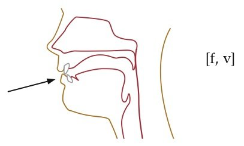

Figure 21:	Manner of articulation of labio-dental fricatives [f] and [v].

Video. Rachel's English: How to Pronounce F and V consonants

## Dental sounds [∂], [∂̞] and [ɵ]
The tip of the tongue is placed between the upper and bottom front teeth, making loose contact. The air is forced its way through the narrow passage formed by the teeth and tongue, which causes the frication characteristic of these sounds. There is a voiceless sound [ɵ], and two voiced allophones [∂] and [∂̞]. The latter is used when a word is not fully enunciated (in particular in the context of consonant reduction). In [∂̞] the tongue does not go through the teeth fully, but just stays behind the teeth and presses them a little bit. This allophone is called a dental approximant. In the video in the following picture this sound is covered. Both phonemes /ɵ/ and /∂/ are associated to spelling th.

[![Rachel's English: How to Pronounce TH Consonants [θ] + [ð]](http://img.youtube.com/vi/VUAYmTnWaCY/0.jpg)](http://www.youtube.com/watch?v=VUAYmTnWaCY)

Video. Rachel's English: How to Pronounce TH Consonants [θ] + [ð]

## Alveolar sounds [s] and [z]
Sounds [s] and [z] have the same manner and place of articulation; they only differ in voicing. Sound [s] is voiceless, whereas sound [z] is voiced. As for their articulation, the blade of the tongue is raised towards the roof of the mouth. The tip of the tongue rests just behind the bottom front teeth; see the following picture.

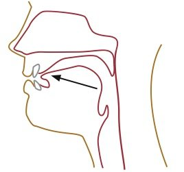

Fig. Manner of articulation of alveolar fricatives [s] and [z].

Furthermore, earlier on we defined sounds [s] and [z] as being sibilants. The tongue is thus curved along its medial axis, with its sides actually touching the alveolar ridge and forming a narrow passage or groove through which the airstream passes. That is the way this sibilant consonant is produced. Lips are parted and the corners pull back as in a smile. In Figure 25, we can see the articulatory gesture for [s] as in saw pronounced by Ladefoged. On the right, the solid line shows the position of the tongue, as extracted from x-rays, whereas the grey line indicates the position of the sides of the tongue, as given by palatograms. Between both lines, it is possible to imagine the exact tongue shape for this sound. On the left, it is shown a transverse view taken from the coronal section (indicated by the arrow on the left).

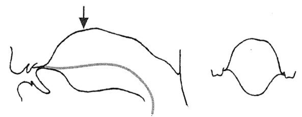

Fig. Tongue shape for alveolar fricatives [s] and [z].

Note that in the above picture the tip of the tongue is not exactly behind the bottom front teeth as described above, but just behind the upper front teeth. There are certain positional variation for the tongue in this respect.

Consonant [s] has a quite characteristic high-pitched, hissing sound that other similar [s]-sounds from other languages do not to have. For example, compared to the Spanish [s]-sound, some differences with respect to the English [s]-sound can be perceived. Spanish [s] is apical[ˈæpɪkl], that is, it is produced with the tip of the tongue rather than with the blade (these consonants are called laminal[ˈlæmənəl]). Some authors even speak of a little retroflex (curling back) of the tongue in the case of the Spanish [s]-sound, which would account for differences in timbre and pitch (Spanish [s] is perceived as lower in pitch than English [s]).

In the video below Rachel explains both sounds [s] and [z] and pays close attention to tongue and lip position.

[![Rachel's English: How to Pronounce CH [ʧ] and JJ [ʤ] Sounds](http://img.youtube.com/vi/unfuGPc3iXo/0.jpg)](http://www.youtube.com/watch?v=unfuGPc3iXo)

Video. Rachel's English: How to Pronounce CH [ʧ] and JJ [ʤ] Sounds

## Alveolar sounds [s] and [z]
Sounds [s] and [z] have the same manner and place of articulation; they only differ in voicing. Sound [s] is voiceless, whereas sound [z] is voiced. As for their articulation, the blade of the tongue is raised towards the roof of the mouth. The tip of the tongue rests just behind the bottom front teeth; see Figure 24.

## Affricate consonants ([ʧ] and [ʤ])
An affricate consonant begins as a stop and is released as a fricative. In English there are only two affricate sounds, [ʧ] and [ʤ].

### Consonants [ʧ] and [ʤ]
Sound [ʧ] is voiceless and sound [ʤ] is voiced. Both are the combination of an alveolar stop and a post-alveolar fricative. The IPA symbols indicate the combination of the consonant sounds ([t]+[ʃ]=[ʧ] and [d]+[ʒ]=[ʤ]). In the case of the voiceless affricate [ʧ], stop [t] is less aspirated than [th]; the manner and place of articulation of the post-alveolar is exactly the same as in [ʃ]. This also applies to the voiced sound [ʤ]. Common spellings for [ʧ] are ch, t, and tch, as in choose, question, or catch. In the case of [ʤ], its most common spellings are j in initial position, as in job; letter g, as in general; and combinations ge and dge, as in large and fridge.

Video. Rachel's English: How to Pronounce S and Z consonants.

Common spellings of sound [s] are:
- Letter s in word-initial, as in son[sʌn], and also within a word, as in bus[bʌs].
- The formation of plural, third person of present simples, and Saxon genitive require adding an [s] if the word-final sound is a voiceless non-sibilant. See Section 3.3subsection on voicing of consonants above.
- Letter c in word-initial, as in city[ˈsɪɾi], and also within a word, as in pencil.
- Spelling sc is sometimes pronounced as [s], as in scissors[ˈsɪzərz].

Common spellings of sound [z] are:
- Letter z in word-initial, as in zoo[zu:], and also within a word, as in easy[ˈi:zi].
- The formation of plural, third person of present simples, and Saxon genitive require adding an [z] if the word-final sound is a voiced non-sibilant and [ɪz] if the word-final sound is a sibilant, either voiced or voiceless. Again, check out Section 3.3subsection.
- Combination zz, as in dizzy[ˈdɪzi].
Spelling ss is sometimes pronounced as [z], as in scissors[ˈsɪzərz].

## Post-alveolar sounds [ʃ] and [ʒ]
The two post-alveolar sounds take the same tongue position, [ʃ] being the voiceless consonant and [ʒ] its voiced counterpart. In these sounds the front of the tongue is curled (hence, the term post-alveolar) and approaches the roof of the mouth without touching it; see the following picture. The hard palate is a relatively large area. Here the tongue approaches the area immediately after the alveolar ridge (hence, the term post-alveolar) as opposed to palatal consonants, where the approximation takes place at the centre of the hard palate. Since it is also a sibilant consonant, the centre of the tongue forms a groove or channel. The sound is produced by the frication created when the airstream passes through that narrow passage. The tip of the tongue is relaxed and slightly touching the bottom front teeth. The lips are a little bit rounder to help channel the airstream.

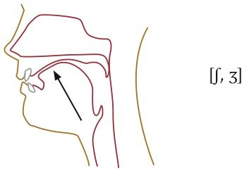

Fig. Pronunciation of sounds [ʃ] and [ʒ].

Taken from the paper by Stone and Lundgerg, the tongue shape corresponding to sound [ʃ] is shown in the following picture. This is a 3-D reconstruction by using spline interpolation from 2-D measures on the tongue. The groove characteristic of this sibilant sound is quite noticeable. The air is directed by the tongue through this groove along plane A and perpendicularly to plane B.

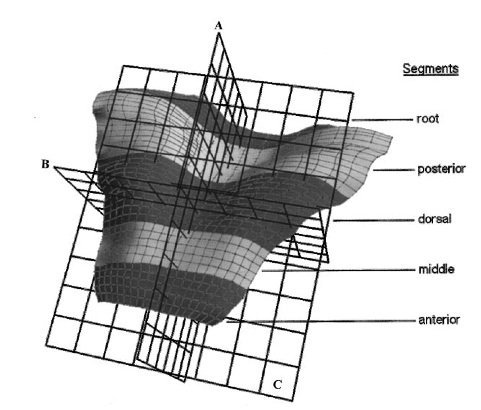

Fig. Tongue shape for [ʃ]. Anterior is on the lower left and posterior on the upper right.

The most common spelling for [ʃ] is sh, as in shop[ʃɑ:p]; less common spellings are: c, as in ocean[ˈoʊʃn]; ch, as in machine[məˈʃi:n]; or initial s, as in sure[ʃʊr]. As for the voiced sound [ʒ], which is rare in English, it is normally spelled s or si, as in usual[ˈju:ʒəl] or Asia[ˈeɪʒə].

Here we have Rachel’s video explaining the pronunciation of these two sounds.

[![Rachel's English: How to Pronounce SH [ʃ] and ZH [ʒ] consonants](http://img.youtube.com/vi/wr2adpD6sYU/0.jpg)](http://www.youtube.com/watch?v=wr2adpD6sYU)

Video. Rachel's English: How to Pronounce SH [ʃ] and ZH [ʒ] consonants

## Glottal sound [h]
This is a complicated sound to describe from a technical point of view. By its manner of articulation it is classed as a fricative, although for some authors this sound lacks some basic characteristics of a consonant and is, therefore, treated as a vowel or a transitional state of the glottis. Here, it will be considered a glottal fricative. The sound [h] is produced by the vocal cords coming close together, without touching each another, and vibrating. Since the sound is produced in the larynx, the mouth position usually corresponds to the next sound in the word; see the video by Rachel below. In the video below around minute 0:45 we can see how the vocal cords produce sound [h]. Sound [h] is usually spelled h, as in here[hɪɻ].

Video. Rachel's English: How to Pronounce the H consonant

## Nasal consonants
In this kind of consonants the air can escape freely from the nose because the soft palate does not lean against the rear wall of the throat but just hangs loosely. Therefore, the air passes through the oral and nasal cavities. Nasal consonants in English are [m], [n], and [ɳ]. However, these consonants are actually stops and during the closure and blockage stages the air only escapes from the nose.
### Stops [m], [n], and [ɳ]
Consonant [m] is a bilabial stop, consonant [n] is alveolar stops, and consonant [ɳ] is a velar stop. They can be thought of as the nasal version of the oral consonants [b], [d] and [g], respectively. In Figure 33, the difference in terms of manner and place of articulation between sounds [m] and [p, b] can be observed. The soft palate is lowered allowing the air escape from the nose. These changes several features of the produced sound, as resonance, amplitude (it is lower than in stops or other consonants), and timbre.

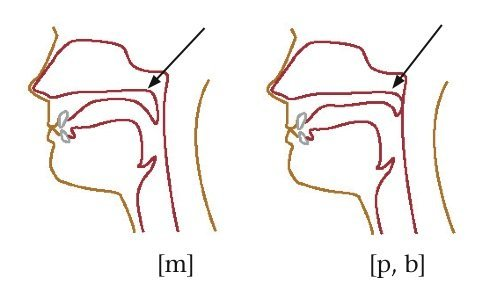

Fig. Pronunciation of sound [m] as compared to oral bilabial stops

Sound [m] is usually spelled m or mm, as in more or comb. In the video below Rachel explains the pronunciation of this sound.

Video. Rachel's English: How to Pronounce M consonant

Apart from nasality, sound [n] is pronounced as [t] in terms of manner and place of articulation, that is, it is an alveolar stop. Sound [n] is usually spelled n, nn, or kn, as in not, sunny, or know. In the video below Rachel explains the pronunciation of this sound.

Video. Rachel's English: How to Pronounce N consonant

Last nasal sound is [ɳ], a velar stop like [k] and [g]. In the following picture, phonemes [ɳ] and [k] are compared. In the case of [ɳ] the back of the tongue and the soft palate meet in such a way the nasal tract is not sealed off.

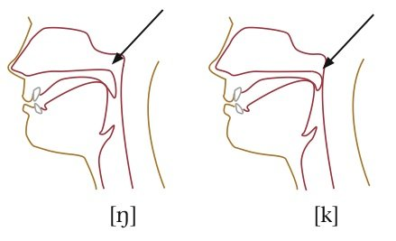

Fig. Pronunciation of phoneme [ɳ] as compared to oral velar stops

Sound [ɳ] is associated with some fixed spellings:
- The ending of the present participle ing, as in eating[ˈi:tɪɳ].
- Letter n before k, g pronounced as velar stops is pronounced as ɳ, as in think[ɵɪɳk], or angry/ˈæɳgɹi/. Therefore, spellings nk are ng frequently associated with this consonant.

[![Rachel's English: How to Pronounce NG [ŋ] Consonant](http://img.youtube.com/vi/NduCJKb4iR8/0.jpg)](http://www.youtube.com/watch?v=NduCJKb4iR8)

Video. Rachel's English: How to Pronounce NG [ŋ] Consonant

## Semivowels
### Palatal semivowel [j]
This semivowel is pronounced in a similar way to vowel [i:], but semivowel [j] is very short. Another difference is that in the case of vowel [i:] the tongue does not touch the roof of the mouth, while in the case of semivowel [j] contact is made. In the articulation of [j] the front of the tongue is raised and then the sides of the tongue touch the hard palate. A groove in the middle of the tongue is formed over which the sound travels. The tip of the tongue are down, just behind the bottom front teeth. Notice that [j] is a central consonant as the air is directed through the centre of the mouth. Sound [j] is usually spelled y, as in year[jɪr].

[![Rachel's English: How to Pronounce the Y [j] consonant](http://img.youtube.com/vi/4F8GAifCdVY/0.jpg)](http://www.youtube.com/watch?v=4F8GAifCdVY)

Video. Rachel's English: How to Pronounce the Y [j] consonant

### Velar semivowel [w]
It is articulated as a voiced approximant at the velum and at the same time is articulated with the lips. More precisely, this sound is termed as a labio-velar approximant[ˈleɪbioʊˈvi:lər] . The articulation of [w] is carried out as follows:

- The lips are projected forward and take on a rounded position.
- The back of the tongue is pulled back and raised and comes close to the soft palate. This position is similar to that of vowel [u:], but the back of the tongue is closer to the soft palate.
- The vocal cords then vibrate and the lips are retracted to the position of the next sound in the word.
- Because the tongue has to move up towards the soft palate, the root of the tongue also moves and narrows a little bit the pharynx. This gives the sound a characteristic timbre.
Sound [w] is usually spelled w or wh, as in way[weɪ], or where[weɻ]. In the video below Rachel explains the production of this sound and gives examples.

Video. Rachel's English: How to Pronounce the W consonant

Fig. Rachel's English: How to Pronounce the W consonant

